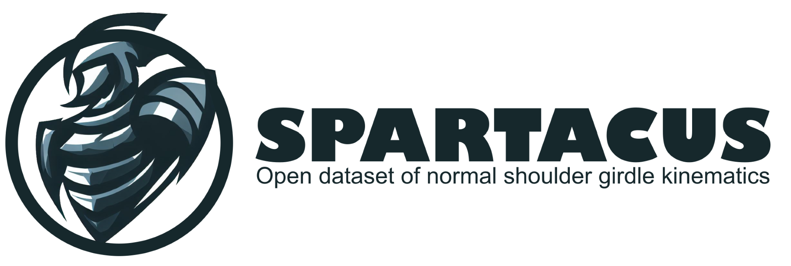

<p align="center" width="100%">

</p>

# Introduction
Gathering all the literature on shoulder kinematics, and scapulo-humeral rhythm
With this repository, We aim to gather all the literature on shoulder kinematics, and scapulo-humeral rhythm.
We will try to keep it updated as much as possible. If you have any suggestions, please let us know.

We assume the continuity of the data between articles. For example, if the same data is used in two articles, and some information is missing in the last one, we pick the information in the previous article.

# Still a work in progress but citable
Moissenet, F., Puchaud, P., Naaïm, A., Holzer, N., & Begon, M. (2024). Spartacus-shoulder-kinematics-dataset/shoulder-kinematics congress (0.1.0). Zenodo. https://doi.org/10.5281/zenodo.11455521

```
@software{moissenet_2024_11455521,
  author       = {Moissenet, Florent and
                  Puchaud, Pierre and
                  Naaïm, Alexandre and
                  Holzer, Nicolas and
                  Begon, Mickael},
  title        = {{Spartacus-shoulder-kinematics-dataset/shoulder- 
                   kinematics congress}},
  month        = jun,
  year         = 2024,
  publisher    = {Zenodo},
  version      = {0.1.0},
  doi          = {10.5281/zenodo.11455521},
  url          = {https://doi.org/10.5281/zenodo.11455521}
}
```

# Table of Contents
[The dataset columns](#The-dataset-columns)
 - [Metadata](##Metadata)
    - [article_title](###article_title)
    - [authors](###authors)
    - [year](###year)
    - [journal](###journal)
- [Experimental conditions](##Experimental-conditions)
    - [invivo](###invivo)
    - [experimental means](###experimental-means)
    - [nb_shoulders](###nb_shoulders)
    - [type_of_movement](###type_of_movement)
    - [active](###active)
    - [posture](###posture)
- [Generic segment columns](##Generic-segment-columns)
    - [XXX_is_isb](###XXX_is_isb)
    - [XXX_is_correctable](###XXX_is_correctable)
    - [XXX_correction_method](###XXX_correction_method)
    - [XXX_origin](###XXX_origin)
    - [XXX_X, XXX_Y or XXX_Z](###XXX_X,-XXX_Y-or-XXX_Z)
- [Thoracohumeral](##Thoracohumeral-columns)
    - [thoracohumeral_sequence](###thoracohumeral_sequence)
    - [thoracohumeral_angle](###thoracohumeral_angle)
    - [thoracohumeral_usable](###thoracohumeral_usable)
    - [thoracohumeral_risk](###thoracohumeral_risk)
- [Joint motion columns](##Joint-motion-columns)
    - [humeral_motion](###humeral_motion)
    - [joint](###joint)
    - [parent](###parent)
    - [child](###child)
    - [euler_sequence](###euler_sequence)
    - [origin_displacement](###origin_displacement)
    - [displacement_cs](###displacement_cs)
    - [displacement_absolute](###displacement_absolute)
    - [displacement_correction_method](###displacement_correction_method)
-[Data columns and array of data](##Data-columns-and-array-of-data)
    - [is_data_mean](###is_data_mean)
    - [shoulder_id](###shoulder_id)
    - [source_extraction](###source_extraction)
    - [data_humero_thoracic_elevation](###data_humero_thoracic_elevation)
    - [dof_1st_euler](###dof_1st_euler)
    - [dof_2nd_euler](###dof_2nd_euler)
    - [dof_3rd_euler](###dof_3rd_euler)
    - [data_translation_x](###data_translation_x)
    - [data_translation_y](###data_translation_y)
    - [data_translation_z](###data_translation_z)
    
# The dataset columns
The dataset is a csv file, each row aim to represent a joint movement as a function of the humerothoracic elevation angle.
The columns are the following:

## Metadata

### article_title
variable type: string
The title of the article

### authors
variable type: string
The authors of the article

### year
variable type: integer
The year of publication

### journal
variable type: string
The journal where the article was published

## Experimental conditions

### in vivo
variable type: boolean
True if the article is in vivo, False if it is ex vivo

### experimental means
variable type: string
The experimental means used in the article:
- intra cortical pins
- biplanar x-ray
- biplane x-ray fluoroscopy  (when this not static, but dynamic)
- 4DCT: 3D CT-scan with time.
- to be completed ...

### nb shoulders
variable type: integer
The number of shoulders/ subjects in the article, sometimes right and left shoulders are counted as two shoulders

### type of movement
variable type: string
The type of movement:
- Dynamic
- Quasi-static
- to be completed ...

### active
variable type: boolean
True if the movement is active, False if it is passive (i.e. related to a muscular control, e.g. in vivo quasi-static in standing posture is active, but in vivo quasi-static in lying posture may be inactive)

### posture
variable type: string
The posture of the subject when the data was collected:
- standing
- sitting

## Generic segment columns

This columns are generic for the following key words:
- thorax
- humerus
- scapula
- clavicle

examples: humerus_is_isb, clavicle_is_isb, scapula_is_isb

### XXX_is_isb
variable type: boolean
True if the segment follows the ISB recommendations, False otherwise

### Thorax_is_global
variable type: boolean
True if the global coordinate system is considered as the thorax.
This column is only revelant for the Thorax.

### XXX_is_isb_correctable
variable type: boolean
True if the segment coordinates system can be corrected to follow the ISB recommendations, False otherwise

### XXX_correction_method
variable type: string
The method used to correct the segment coordinates system to follow the ISB recommendations:
- to_isb : consisting in switching axis to follow the ISB recommendations
- to_isb_like : consisting in switching axis to follow the ISB recommendations as much as possible
- to_kolz_ac_to_pa : consisting in switching axis from acromio-clavicular joint to posterior aspect of the acromion
- glenoid_to_isb_cs : available from Dal Maso et al. 2014
- to be completed ...

Note: two methods can be combined, to get back to the ISB recommendations, might be a list of strings at the end of the day
Note: 
- If XXX_is_isb is true -> XXX_is_isb_correctable=nan and XXX_correction_method=nan
- If XXX_is_isb is false -> XXX_is_isb_correctable=true and XXX_correction_method=not nan
- If XXX_is_isb is false -> XXX_is_isb_correctable=false and XXX_correction_method=nan, it means we are already in a ISB-like configuration with offset,we cannot master.

### XXX_origin
variable type: string

The anatomical landmark used as origin for the segment coordinates system:
Most of the landmarks comes from Wu et al. 2005:

#### Thorax:
- From Wu et al. 2005
  - C7, Processus Spinosus (spinous process) of the 7th cervical vertebra
  - T8, Processus Spinosus (spinal process) of the 8th thoracic vertebra
  - IJ, (Incisura Jugularis), also refered as Deepest point of Incisura Jugularis (suprasternal notch)
  - PX, Processus Xiphoideus (xiphoid process), most caudal point on the sternum
- Other landmarks
  - T7, (7th thoracic vertebra)
  - anterior face of T1
  - Glenoid center (Sahara et al. 2007)

#### Clavicle:
- Wu et al. 2005 :
  - SC, Most ventral point on the sternoclavicular joint
  - AC, Most dorsal point on the acromioclavicular joint (shared with the scapula)
- Other:
  - Point of intersection between the mesh model and the Zc axis (Sahara et al. 2006)

#### Scapula:
- Wu et al. 2005 :
  - TS, Trigonum Spinae Scapulae (root of the spine), the midpoint of the triangular surface on the medial border of the scapula in line with the scapular spine
  - AI, Angulus Inferior (inferior angle), most caudal point of the scapula
  - AA, Angulus Acromialis (acromial angle), most laterodorsal point of the scapula
  - PC, Most ventral point of processus coracoideus
- Other landmarks:
  - Glenoid center

#### Humerus:
- Wu et al. 2005:
  - GH, Glenohumeral rotation center, (or gleno-humeral head center )
  - EL, Most caudal point on lateral epicondyle
  - EM, Most caudal point on medial epicondyle
- Other landmarks:
  - midpoint EM EL: the middle of the two latters


### XXX_X, XXX_Y or XXX_Z
variable type: string
X, Y and Z denote the axis of the segment coordinates system.
The anatomical direction of the axis:
- +posteroanterior: the axis is pointing anteriorly
- -posteroanterior: the axis is pointing posteriorly
- +mediolateral: the axis is pointing medially
- -mediolateral: the axis is pointing laterally
- +superoinferior: the axis is pointing superiorly
- -superoinferior: the axis is pointing inferiorly

This nomenclature/terminology has been chosen because in the case the segement coordinate system doesn't properly follow the ISB recommandations,
the axis can vaguely point in the direction, but not strictly regarding the ISB recommendations.

## Thoracohumeral columns
### thoracohumeral_sequence
variable type: string
The sequence of the thoracohumeral joint:
- yxy
- zyx
- unknown (we have clear data but don't know how it has been computed)

### thoracohumeral_angle
variable type: string
When no sequence is given, the thoracohumeral angle is given:
- angle(yt, yh)
- controlled by operator: probably goniometer
- unknown (we have clear data but don't know how it has been computed)

### thoracohumeral_usable
variable type: boolean
True if the thoracohumeral joint can be used to compute the humerothoracic elevation angle, False otherwise

### thoracohumeral_risk
variable type: boolean
True if the thoracohumeral joint is usable, but can be used with a risk, False otherwise
A risk is known when the thoracohumeral joint is not perfectly in accordance with the ISB recommendations,
but the thoracohumeral joint can still be used as the data may be valuable.


## Joint motion columns

### humeral_motion
variable type: string
The motion performed:
- frontal elevation
- scapular elevation
- sagittal elevation
- internal-external rotation 90 degree-abducted
- internal-external rotation 0 degree-abducted

### joint
variable type: string
The joint name considered on the row: of the csv file :
- sternoclavicular
- scapulothoracic
- acromioclavicular
- glenohumeral

### parent or child
variable type: string
The segment considered as parent of the joint:
- thorax
- scapula
- clavicle
- humerus

### euler_sequence
variable type: string
The sequence of the joint:
- yxz: ISB for sternoclavicular, acromioclavicular and scapulothoracic joints when segment follows ISB recommendations)
- yxy: ISB for glenohumeral, thoracohumeral joints when segment doesn't follow ISB recommendations)
- zyx
- to be completed ...

### origin_displacement
variable type: string
The anatomical landmark used as origin for the translation:
- humeral head

### displacement_cs
variable type: string
segment name or joint name. It may refer to the proximal, distal or joint coordinate system

### displacement_absolute
variable type: boolean
True if the displacement is absolute, False if it is relative (in percentage).

### displacement_correction_method
variable type: string
The method used to correct the displacement:
- Lagace2012 (not sure yet)

## Data columns and array of data

### is_data_mean
variable type: boolean
True if the data is the mean of the subjects, False otherwise

### shoulder_id
variable type: integer
The id of the shoulder/subject, if the data is not the mean of the subjects

### source_extraction
variable type: string
The source of the data:
- data: the data comes from a data file
- engauged: the data comes from the software Engauge

### data_humero_thoracic_elevation
variable type: array of floats
The humero-thoracic elevation data to describe the shoulder rhythm of the joint, in degrees (to be confirmed)

### dof_1st_euler
variable type: array of floats
The first euler angle of the joint, in degrees (to be confirmed)

### dof_2nd_euler
variable type: array of floats
The second euler angle of the joint, in degrees (to be confirmed)

### dof_3rd_euler
variable type: array of floats
The third euler angle of the joint, in degrees (to be confirmed)

### dof_translation_x
variable type: array of floats
The translation along the x axis of the joint, in mm (to be confirmed)

### dof_translation_y
variable type: array of floats
The translation along the y axis of the joint, in mm (to be confirmed)

### dof_translation_z
variable type: array of floats
The translation along the z axis of the joint, in mm (to be confirmed)


### Exceptions, too exotic
Sahara et al 2006 : The scapula coordinate system is the clavicle coordinate system at abduction zero degree. The scapua frame is very exotic and not convertable to ISB standards.

### Risks evocated
- Gutierez et al. 2017: X-clavicule not built with x thoracic in reference posture but it is very close.

### Risks too high
- Hallström et al. 2006: no euler sequence, no scapula coordinate systems. cannot even considered as reliable. not even possible to understand what has is done.
